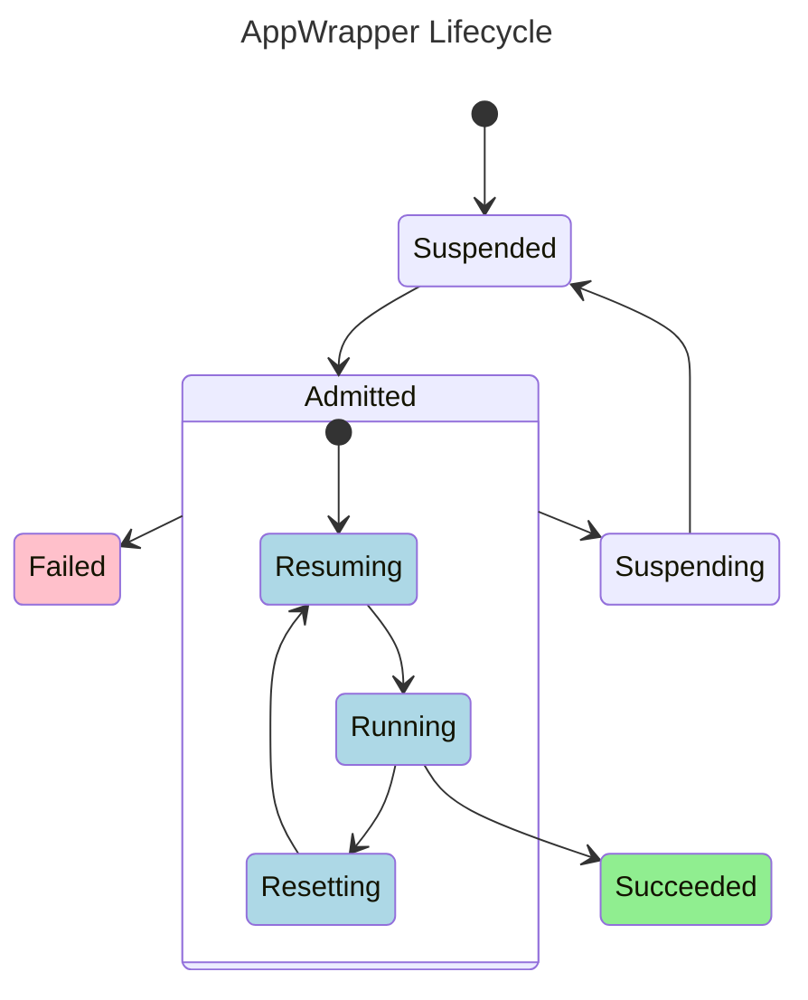

# MLBatch for CodeFlare users

MLBatch is an evolution of the [CodeFlare](https://github.com/project-codeflare)
stack for managing AI/ML workloads on Kubernetes and its workload dispatcher
[MCAD](https://github.com/project-codeflare/multi-cluster-app-dispatcher).

Like MCAD, MLBatch is designed to queue workloads and dispatch them over time,
accounting for quotas, priorities, and precedence. MLBatch relies on
[AppWrappers](https://github.com/project-codeflare/appwrapper) to bundle
together all the components of a workloads such as pods, PyTorch jobs, Ray jobs,
config maps, secrets, etc. AppWrappers in MLBatch offer improved mechanisms to
automatically detect and retry failed workloads. MLBatch includes a
backward-compatible [pytorch-generator](tools/pytorchjob-generator/) Helm
template to facilitate the specification of PyTorch jobs.

In this document, we review the key innovations introduced by MLBatch and
differences with the earlier setup built around MCAD.

## Kueue

MLBatch replaces MCAD with [Kueue](https://kueue.sigs.k8s.io) to queue and
dispatch jobs. Kueue introduces a new quota management system based on [cluster
queues](https://kueue.sigs.k8s.io/docs/concepts/cluster_queue/). This quota
system provides more flexibility to allocate compute resources (CPU, memory, and
GPU quotas) that [resource
quotas](https://kubernetes.io/docs/concepts/policy/resource-quotas/) in core
Kubernetes. In particular, it makes it possible to run workloads over quota
whenever there is idle capacity in a cluster.

For various reasons, workloads are not directly submitted to cluster queues but
rather to namespaced [local
queues](https://kueue.sigs.k8s.io/docs/concepts/local_queue/) that feed into the
cluster queues. By convention in MLBatch, each team is assigned a namespace and
a cluster queue dedicated to the team. For example, the _platform_ team is
assigned to namespace `platform` and its associated cluster queue named
`platform-cluster-queue`. The local queue name is always `default-queue`. Hence,
the `default-queue` in namespace `platform` feeds into the
`platform-cluster-queue`. In short, all workloads must be submitted to the local
queue named `default-queue` but to review quota allocation and usage, one has to
query the cluster queues.

MLBatch offers a simple [cluster-checker](tools/cluster-checker/) tool to get a
bird’s-eye view of quotas on a cluster from a GPU perspective:
```sh
node checker.js
```
```
CLUSTER QUEUE            GPU QUOTA   GPU USAGE   ADMITTED WORKLOADS   PENDING WORKLOADS
code-cluster-queue               8          16                    1                   0
platform-cluster-queue           8           4                    4                   0

Total GPU count in cluster:        24
Unschedulable GPU count:         -  0
Schedulable GPU count:           = 2
Nominal GPU quota:                 16
Slack GPU quota:                 +  8
Total GPU quota:                 = 24

GPU usage by admitted workloads:   20
Borrowed GPU count:                 8
```
The tool enumerates the cluster queues defined on the cluster showing the GPU
quota for each team as well as the number of GPUs in use by admitted workloads.
The GPU usage may exceed the GPU quota for a team if this team is borrowing idle
capacity from the cluster.

The tool also reports the total GPU capacity distinguishing healthy (i.e.,
schedulable, available for use) and unhealthy (i.e., unschedulable, unavailable)
GPUs. The nominal GPU quota represents to cumulative GPU quota across all the
teams. MLBatch recommends that cluster admins keep the nominal quota below the
cluster capacity to avoid oversubscribing the GPUs. Typically, a small number of
GPUs is not allocated to any team but retained as a slack quota that any team
may borrow from. MLBatch automatically adjusts the slack quota to ensure the
schedulable GPU count and nominal quota remain equal, unless of course this
slack becomes virtually negative, in which case a cluster admin should decide
how to reduce the nominal quota.

For more details about the cluster queues run:
```sh
kubectl describe clusterqueues
```

## AppWrappers

MLBatch recommends submitting every workload as an
[AppWrapper](https://github.com/project-codeflare/appwrapper). AppWrappers offer
a number of checks, guarantees, and benefits over submitting unwrapped
[PyTorchJobs](https://www.kubeflow.org/docs/components/training/user-guides/pytorch/)
for example. In particular, the AppWrapper controller automatically injects:
- labels holding the name and id of the user submitting the AppWrapper,
- the `queueName` label required to queue the workload in the `default-queue`,
  and
- the `schedulerName` specification required to enable gang scheduling and
  packing on the GPU dimension to mitigate node fragmentation.

Moreover, the AppWrapper controller consistently handles cleanup and retries
across all types of workloads:
- The resources, especially the GPUs, utilized by a failed workload are returned
  to the cluster in a timely manner, i.e., within minutes by default, with a
  configurable grace period to permit post-mortem debugging. Cluster admins can
  enforce an upper bound on this grace period to avoid resource wastage.
- The Kubernetes objects associated with a completed workload, in particular the
  pods and their logs, are eventually disposed of, by default after a week.
- Failed workloads are automatically retried up to a configurable number of
  attempts.

The AppWrapper specification has been greatly simplified for MLBatch. In most
cases, an AppWrapper yaml adds a simple prefix to a workload yaml, for instance
for a pod:
```yaml
# appwrapper prefix
apiVersion: workload.codeflare.dev/v1beta2
kind: AppWrapper
metadata:
  name: wrapped-pod
spec:
  components:
  - template:
      # indented pod specification
      apiVersion: v1
      kind: Pod
      metadata:
        name: sample-pod
      spec:
        restartPolicy: Never
        containers:
        - name: busybox
          image: quay.io/project-codeflare/busybox:1.36
          command: ["sh", "-c", "sleep 5"]
          resources:
            requests:
              cpu: 1
```
To submit this workload to the cluster, save this yaml to `wrapped-pod.yaml` and
run:
```sh
kubectl apply -f wrapped-pod.yaml
```

MLBatch includes an [appwrapper-packager](tools/appwrapper-packager/) tool to
automate the addition this prefix as well as the indentation of the workload
specification. In addition, MLBatch includes a new implementation of the
[pytorch-generator](tools/pytorchjob-generator/) tool to facilitate the
configuration of PyTorch jobs including the addition of the AppWrapper prefix.

As a result of the AppWrapper simplification for MLBatch, AppWrappers now in
version `v1beta2` are not backward compatible with MCAD's `v1beta1` AppWrappers.
The companion pytorch-generator tool for MCAD is not compatible with MLBatch.
However, the pytorch-generator tool included in MLBatch is backward compatible
with the input format of the legacy tool. In other words, simply rerun `helm
template` on the input `value.yaml` files to generate proper `v1beta2`
AppWrappers. Please note that existing fault-tolerance-related settings from
these input files will be ignored and default will be used instead. Please refer
to the tool [documentation](tools/pytorchjob-generator/) for how to override
settings such as max retry counts.

The list of all AppWrappers in a namespace is obtained by running:
```sh
kubectl get appwrappers
```
```
NAME          STATUS      QUOTA RESERVED   RESOURCES DEPLOYED   UNHEALTHY
wrapped-pod   Succeeded   False            True                 False
```
The status of an AppWrapper is one of:
- Suspended: the AppWrapper is queued,
- Resuming: the AppWrapper is transitioning to Running,
- Running: the AppWrapper is running,
- Succeeded: the execution completed successfully,
- Failed: the execution failed and will not be retried,
- Resetting: a failure has been detected during the current execution and the
  AppWrapper is preparing to retry,
- Suspending: the AppWrapper has been evicted by Kueue and is transitioning back
  to Suspended.



In addition, this AppWrapper table also reports:
- quota reserved: whether Kueue has reserved the quota requested by the
  AppWrapper,
- resource deployed: whether the resources wrapped by the AppWrapper, such as
the `sample-pod` in this example have been created on the cluster,
- unhealthy: whether a failure has been detected during the current execution of
  the AppWrapper.

For example, a `Running` AppWrapper has both quota reserved and resource
deployed. A `Succeeded` AppWrapper will no longer reserve quota but the wrapped
resources such as terminated pods will be preserved on the cluster for a period
of time as discussed above to permit log collection. A `Failed` AppWrapper will
transiently continue to reserve quota until the wrapped resources have been
undeployed, so as to avoid oversubscribing GPUs during the cleanup of failed
jobs.

More details about an AppWrapper condition may be obtained by describing the
AppWrapper:
```sh
kubectl describe appwrapper wrapped-pod
```
Kueue creates and maintains a companion `workload` object for each workload it
manages. Further details about the AppWrapper condition such as Kueue's
rationale for evicting the workload may be obtained by accessing this companion
object:
```sh
kubectl get workloads
```
```
NAME                           QUEUE           RESERVED IN           ADMITTED   AGE
appwrapper-wrapped-pod-81d3e   default-queue   team1-cluster-queue   True       161m
```
```sh
kubectl describe workload appwrapper-wrapped-pod-81d3e
```
Workload objects are automatically deleted by Kueue when the workload itself,
i.e., the AppWrapper is deleted.

## Priorities and Preemption

MLBatch supports the `high-priority`, `default-priority`, and `low-priority`
priority classes.

To override the default `default-priority` of a workload, simply add a
`priorityClassName` to the specification of the wrapped pod templates, for
example:
```yaml
# appwrapper prefix
apiVersion: workload.codeflare.dev/v1beta2
kind: AppWrapper
metadata:
  name: wrapped-pod
spec:
  components:
  - template:
      # indented pod specification
      apiVersion: v1
      kind: Pod
      metadata:
        name: sample-pod
      spec:
        priorityClassName: high-priority # workload priority
        restartPolicy: Never
        containers:
        - name: busybox
          image: quay.io/project-codeflare/busybox:1.36
          command: ["sh", "-c", "sleep 5"]
          resources:
            requests:
              cpu: 1
```
Workloads of equal priority are considered for admission in submission order.
Higher-priority workloads are considered for admission before lower-priority
workloads irrespective of arrival time. However, workloads that cannot be
admitted will not block the admission of newer and/or lower-priority workloads
(if they fit within the quota).

A workload will preempt lower-priority workloads in the current namespace to
meet its quota if necessary as well as workloads from other namespaces borrowing
quota from the current namespace. A workload may also preempt newer,
equal-priority workloads in the same namespace. In contrast, a workload will
never preempt workloads from another namespace as long as this namespace stays
below or at its nominal quota, irrespective of workload priorities.

Kueue forbids workloads to rely on preemption and quota borrowing at the same
time. In particular, a workload that exceeds by itself the namespace nominal
quota cannot trigger preemption.
