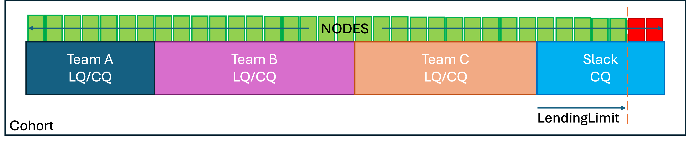

# Quota Maintenance

A *team* in MLBatch is a group of users that share a resource quota. 

In Kueue, the `ClusterQueue` is the abstraction used to define a pool
of resources (`cpu`, `memory`, `nvidia.com/gpu`, etc.) that is
available to a team.  A `LocalQueue` is the abstraction used by
members of the team to submit workloads to a `ClusterQueue` for
execution using those resources.

Kubernetes built-in `ResourceQuotas` should not be used for resources that
are being managed by `ClusterQueues`. The two quota systems are incompatible.

We strongly recommend maintaining a simple relationship between
between teams, namespaces, `ClusterQueues` and `LocalQueues`. Each
team should assigned to their own namespace that contains a single
`LocalQueue` which is configured to be the only `LocalQueue` that
targets the team's `ClusterQueue`.

The quotas assigned to a `ClusterQueue` can be dynamically adjusted by
a cluster admin at any time.  Adjustments to quotas only impact queued
workloads; workloads already admitted for execution are not impacted
by quota adjustments.

For Kueue quotas to be effective, the sum of all quotas for each managed
resource (`cpu`, `memory`, `nvidia.com/gpu`, `pods`) must be maintained to
remain less than or equal to the available cluster capacity for this resource.
Concretely, for cluster with 256 NVIDIA GPUs dedicated to MLBatch users, the
cumulative `nomimalQuota` for the `nvidia.com/gpu` resource should be 256 or
less. Quotas should be reduced when the available capacity is reduced whether
because of failures or due to the allocation of resources to non-batch
workloads.

To facilitate the necessary quota adjustments, we recommend setting up
a dedicated `ClusterQueue` for slack capacity that other `ClusterQueues`
can borrow from. This queue should not be associated with any team,
project, namespace, or local queue. Its `lendingLimit` should be adjusted
dynamically to reflect changes in cluster capacity. If sized
appropriately, this queue will make adjustments to other cluster
queues unnecessary for small cluster capacity changes. The figure
below shows this recommended setup for an MLBatch cluster with three
teams. Beginning with RHOAI 2.12 (AppWrapper v0.23), the dynamic
adjustment of the Slack `ClusterQueue` `lendingLimit` can be
configured to be fully automated. 


Every resource name occurring in the resource requests or limits of a workload
must be covered by a `ClusterQueue` intended to admit the workload, even if the
requested resource count is zero. For example. a `ClusterQueue` must cover
`nvidia.com/roce_gdr`, possibly with an empty quota, to admit a `PyTorchJob`
requesting:
```yaml
  resources:
    requests:
      cpu: 1
      memory: 256Mi
      nvidia.com/roce_gdr: 0
    limits:
      cpu: 1
      memory: 256Mi
      nvidia.com/roce_gdr: 0
```
