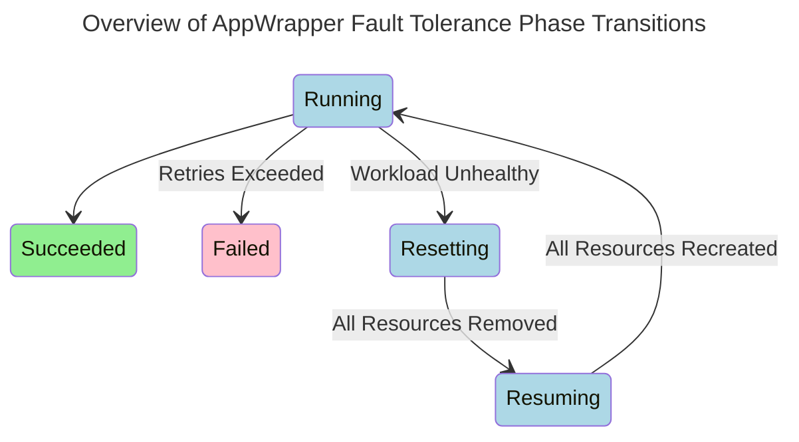

# MLBatch Quick Start

MLBatch supports `PyTorchJobs`, `RayJobs`, `RayClusters`, as well as
`AppWrappers`, which can wrap and bundle together resources such as `Pods`,
`Jobs`, `Deployments`, `StatefulSets`, `ConfigMaps`, or `Secrets`.

This document first explains [queues](#queues) then discusses a few [examples
workloads](#example-workloads), [monitoring](#monitoring-workloads-and-queues),
[borrowing](#borrowing-and-reclamation),
[priorities](#priorities-and-preemption), and
[fault-tolerance](#fault-tolerance).

It is not required to clone this repository to use an MLBatch system. However,
if you want local copies of the examples to enable you to easily try then, you
can recursively clone and enter this repository:
```sh
git clone --recursive https://github.com/project-codeflare/mlbatch.git
cd mlbatch
```

## PyTorchJobs via the MLBatch Helm Chart

Properly configuring a distributed `PyTorchJob` to make effective use of the
MLBatch system and hardware accelerators (GPUs, RoCE GDR) can be tedious. To
automate this process, we provide a Helm chart that captures best practices and
common configuration options. Using this Helm chart helps eliminate common
mistakes. Please see [pytorchjob-generator](tools/pytorchjob-generator) for
detailed usage instructions.

## Queues

All workloads must target a local queue in their namespace. The local queue name
is specified as a label as follows:
```yaml
apiVersion: ???
kind: ???
metadata:
  name: ???
  labels:
    kueue.x-k8s.io/queue-name: default-queue # queue name
```
In MLBatch, the default local queue name is `default-queue`.

Workloads submitted as `AppWrappers` do not need to explicity specify the local
queue name as it will be automatically added if missing. However, other workload
types (`PyTorchJobs`, `RayJobs`, `RayClusters`) must specify the local queue
name as demonstrated above.

Workloads missing a local queue name will not be admitted. If you forget to
label the workload, you must either delete and resubmit it or use `oc edit` to
add the missing label to the metadata section of your workload object.

Submitted workloads are queued and dispatched when enough quota is available,
which eventually results in the creation of pods that are submitted to the
cluster's scheduler. By default, this scheduler will scheduler pods one at a
time and spread pods across nodes to even the load across the cluster. Both
behaviors are undesirable for large AI workloads such as pre-training jobs.
MLBatch includes and configures Coscheduler to enable gang scheduling and
packing. Concretely, Coscheduler as configured will strive to schedule all pods
in a job at once using a minimal number of nodes.

## Example Workloads

`PytorchJobs`, `RayJobs`, and `RayClusters` may be submitted directly to
MLBatch. Please note however that these workloads will not benefit from the
advanced logic provided by `AppWrappers` for instance pertaining to
[fault-tolerance](#fault-tolerance). Hence, wrapping objects into `AppWrappers`
is the recommended way of submitting workloads.

### PyTorchJobs

To submit an unwrapped `PyTorchJob` to MLBatch, simply include the queue name:
```yaml
apiVersion: kubeflow.org/v1
kind: PyTorchJob
metadata:
  name: sample-pytorchjob
  labels:
    kueue.x-k8s.io/queue-name: default-queue # queue name (required)
spec:
  pytorchReplicaSpecs:
    Master:
      replicas: 1
      restartPolicy: OnFailure
      template:
        spec:
          containers:
          - name: pytorch
            image: docker.io/kubeflowkatib/pytorch-mnist-cpu:v1beta1-fc858d1
            command:
            - "python3"
            - "/opt/pytorch-mnist/mnist.py"
            - "--epochs=1"
            resources:
              requests:
                cpu: 1
    Worker:
      replicas: 1
      restartPolicy: OnFailure
      template:
        spec:
          containers:
          - name: pytorch
            image: docker.io/kubeflowkatib/pytorch-mnist-cpu:v1beta1-fc858d1
            command:
            - "python3"
            - "/opt/pytorch-mnist/mnist.py"
            - "--epochs=1"
            resources:
              requests:
                cpu: 1
```
Try the above with:
```sh
oc apply -n team1 -f samples/pytorchjob.yaml
```
MLBatch implicitly enables gang scheduling and packing for `PyTorchJobs` by
configuring the Kubeflow Training Operator to automatically inject the
necessary scheduling directives into all Pods it creates for `PyTorchJobs`.

### AppWrappers

A `Job`, a `Pod`, or a `Deployment` can be created using an `AppWrapper`, for
example:
```yaml
apiVersion: workload.codeflare.dev/v1beta2
kind: AppWrapper
metadata:
  name: sample-job
spec:
  components:
  - template:
      # job specification
      apiVersion: batch/v1
      kind: Job
      metadata:
        name: sample-job
      spec:
        template:
          spec:
            restartPolicy: Never
            containers:
            - name: busybox
              image: quay.io/project-codeflare/busybox:1.36
              command: ["sh", "-c", "sleep 30"]
              resources:
                requests:
                  cpu: 1
```
Try the above with:
```sh
oc apply -n team1 -f samples/job.yaml
```
Concretely, the `AppWrapper` adds a simple prefix to the `Job` specification.
See [AppWrappers](https://project-codeflare.github.io/appwrapper/) for more
information and use cases.

MLBatch implicitly enables packing for `AppWrappers`. For workloads consisting
of multiple pods, add a `PodGroup` to enable gang scheduling, for instance:
```yaml
apiVersion: workload.codeflare.dev/v1beta2
kind: AppWrapper
metadata:
  name: sample-job
spec:
  components:
  - template:
      # pod group specification
      apiVersion: scheduling.x-k8s.io/v1alpha1
      kind: PodGroup
      metadata:
        name: sample-job
      spec:
        minMember: 2 # replica count
  - template:
      # job specification
      apiVersion: batch/v1
      kind: Job
      metadata:
        name: sample-job
      spec:
        parallelism: 2 # replica count
        completions: 2 # replica count
        template:
          metadata:
            labels:
              scheduling.x-k8s.io/pod-group: sample-job # pod group label
          spec:
            restartPolicy: Never
            containers:
            - name: busybox
              image: quay.io/project-codeflare/busybox:1.36
              command: ["sh", "-c", "sleep 5"]
              resources:
                requests:
                  cpu: 1
```
Try the above with:
```sh
oc apply -n team1 -f samples/job-with-podgroup.yaml
```

## Monitoring Workloads and Queues

Check the status of the local queue for the namespace with:
```sh
oc -n team1 get localqueue
```
```
NAME                                      CLUSTERQUEUE          PENDING WORKLOADS   ADMITTED WORKLOADS
localqueue.kueue.x-k8s.io/default-queue   team1-cluster-queue   0                   1
```
Check the status of the workloads in the namespace with:
```sh
oc -n team1 get workloads
```
```
NAME                                 QUEUE           ADMITTED BY           AGE
pytorchjob-sample-pytorchjob-9fc41   default-queue   team1-cluster-queue   11m
```
As usual, replace `get` with `describe` for more details on the local queue or
workloads. See [Kueue](https://kueue.sigs.k8s.io) for more information.

## Borrowing and Reclamation

A workload can borrow unused quotas from other namespaces if not enough quota is
available in the team namespace unless disallowed by the `ClusterQueue` of the
team namespace (`borrowingLimit`) or target namespace(s) (`lendingLimit`).

Borrowed quotas are immediately returned to the target namespace(s) upon
request. In other words, the submission of a workload in a target namespace will
preempt borrowers if necessary to obtain the quota requested by the new
workload.

## Priorities and Preemption

A workload can specify a priority by means of pod priorities, for instance for a
wrapped job:
```yaml
apiVersion: workload.codeflare.dev/v1beta2
kind: AppWrapper
metadata:
  name: sample-job
spec:
  components:
  - template:
      # job specification
      apiVersion: batch/v1
      kind: Job
      metadata:
        name: sample-job
      spec:
        template:
          spec:
            restartPolicy: Never
            priorityClassName: high-priority # workload priority
            containers:
            - name: busybox
              image: quay.io/project-codeflare/busybox:1.36
              command: ["sh", "-c", "sleep 5"]
              resources:
                requests:
                  cpu: 1
```
Workloads of equal priority are considered for admission in submission order.
Higher-priority workloads are considered for admission before lower-priority
workloads irrespective of arrival time. However, workloads that cannot be
admitted will not block the admission of newer and possibly lower-priority
workloads (if they fit within the quota).

A workload will preempt lower-priority workloads in the same namespace to meet
its quota if necessary. It may also preempt newer, equal-priority workloads in
the same namespace.

Preemption across namespaces can only be triggered by the reclamation of
borrowed quota, which is independent from priorities.

## Fault-tolerance

AppWrappers are the mechanism used by the MLBatch system to automate fault
detection and retry/recovery of executing workloads. By adding automation, we
can achieve higher levels of system utilization by greatly reducing the reliance
on constant human monitoring of workload health. AppWrappers should be used to
submit all workloads that are intended to run without close human supervision of
their progress. 



Throughout the execution of the workload, the AppWrapper controller
monitors the number and health of the workload's Pods. It also watches
the top-level created resources and for selected resources types
understands how to interpret their status information. This information
is combined to determine if a workload is unhealthy. A workload can be
deemed *unhealthy* if any of the following conditions are true:
   + There are a non-zero number of `Failed` Pods.
   + It takes longer than `AdmissionGracePeriod` for the expected
     number of Pods to reach the `Pending` state.
   + It takes longer than the `WarmupGracePeriod` for the expected
     number of Pods to reach the `Running` state.
   + If a non-zero number of `Running` Pods are using resources
     that Autopilot has tagged as `NoExecute`.
   + The status information of a batch/v1 Job or PyTorchJob indicates
     that it has failed.
   + A top-level wrapped resource is externally deleted.

If a workload is determined to be unhealthy by one of the first three
Pod-level conditions above, the AppWrapper controller first waits for
a `FailureGracePeriod` to allow the primary resource controller an
opportunity to react and return the workload to a healthy state. The
`FailureGracePeriod` is elided for the remaining conditions because the
primary resource controller is not expected to take any further
action. If the `FailureGracePeriod` passes and the workload is still
unhealthy, the AppWrapper controller will *reset* the workload by
deleting its resources, waiting for a `RetryPausePeriod`, and then
creating new instances of the resources. During this retry pause, the
AppWrapper **does not** release the workload's quota; this ensures
that when the resources are recreated they will still have sufficient
quota to execute.  The number of times an AppWrapper is reset is
tracked as part of its status; if the number of resets exceeds the
`RetryLimit`, then the AppWrapper moves into a `Failed` state and its
resources are deleted (thus finally releasing its quota). Deletion of
a top-level wrapped resource will cause the AppWrapper directly enter
the `Failed` state independent of the `RetryLimit`.

To support debugging `Failed` workloads, an annotation can be added to an
AppWrapper that adds a `DeletionOnFailureGracePeriod` between the time the
AppWrapper enters the `Failed` state and when the process of deleting its
resources begins. Since the AppWrapper continues to consume quota during this
delayed deletion period, this annotation should be used sparingly and only when
interactive debugging of the failed workload is being actively pursued.

All child resources for an AppWrapper that successfully completed will be
automatically deleted after a `SuccessTTLPeriod` after the AppWrapper entered
the `Succeeded` state.

The parameters of the retry loop described about are configured at the system
level, but can be customized by the user on a per-AppWrapper basis by adding
annotations. The table below lists the parameters, gives their default, and the
annotation that can be used to customize them. The MLBatch Helm chart also
supports customization these values.

| Parameter                    | Default Value | Annotation                                                             |
|------------------------------|---------------|------------------------------------------------------------------------|
| AdmissionGracePeriod         |      1 Minute | workload.codeflare.dev.appwrapper/admissionGracePeriodDuration         |
| WarmupGracePeriod            |     5 Minutes | workload.codeflare.dev.appwrapper/warmupGracePeriodDuration            |
| FailureGracePeriod           |      1 Minute | workload.codeflare.dev.appwrapper/failureGracePeriodDuration           |
| RetryPausePeriod             |    90 Seconds | workload.codeflare.dev.appwrapper/retryPausePeriodDuration             |
| RetryLimit                   |             3 | workload.codeflare.dev.appwrapper/retryLimit                           |
| DeletionOnFailureGracePeriod |     0 Seconds | workload.codeflare.dev.appwrapper/deletionOnFailureGracePeriodDuration |
| SuccessTTL                   |        7 Days | workload.codeflare.dev.appwrapper/successTTLDuration                   |
| GracePeriodMaximum           |      24 Hours | Not Applicable                                                         |

The `GracePeriodMaximum` imposes a system-wide upper limit on all other grace
periods to limit the potential impact of user-added annotations on overall
system utilization.
